# Intégration n8n et Automatisation

Ce guide détaille l'intégration de n8n pour automatiser la gestion des recettes, depuis la soumission jusqu'à la publication.

## 🤖 Qu'est-ce que n8n ?

n8n est une plateforme d'automatisation open-source qui permet de :
- Connecter différents services et APIs
- Automatiser des workflows complexes
- Traiter et transformer des données
- Déclencher des actions basées sur des événements

Pour L'atelier Boulet, n8n automatise :
- Réception et formatage des recettes soumises
- Génération de fichiers Markdown Hugo
- Notification et modération
- Publication automatique (optionnel)

## 📋 Prérequis

### Installation de n8n

#### Option 1 : Docker (Recommandé)

```bash
# Créer un volume pour persister les données
docker volume create n8n_data

# Lancer n8n
docker run -it --rm \
  --name n8n \
  -p 5678:5678 \
  -v n8n_data:/home/node/.n8n \
  n8nio/n8n
```

#### Option 2 : NPM

```bash
# Installation globale
npm install n8n -g

# Lancer n8n
n8n start
```

#### Option 3 : n8n Cloud

Utiliser [n8n.cloud](https://n8n.cloud) pour une solution hébergée.

## 🔧 Configuration du Workflow

### 1. Workflow de Base

Créer un nouveau workflow dans n8n avec ces nœuds :

```json
{
  "name": "Traitement Recettes Blog",
  "nodes": [
    {
      "name": "Webhook",
      "type": "n8n-nodes-base.webhook",
      "position": [250, 300],
      "webhookId": "recipe-submission",
      "parameters": {
        "path": "submit-recipe",
        "method": "POST",
        "responseMode": "onReceived",
        "responseData": "allEntries"
      }
    },
    {
      "name": "Valider Données",
      "type": "n8n-nodes-base.if",
      "position": [450, 300],
      "parameters": {
        "conditions": {
          "string": [
            {
              "value1": "={{$json[\"title\"]}}",
              "operation": "isNotEmpty"
            },
            {
              "value1": "={{$json[\"content\"]}}",
              "operation": "isNotEmpty"
            }
          ]
        }
      }
    },
    {
      "name": "Formater Recette",
      "type": "n8n-nodes-base.code",
      "position": [650, 300],
      "parameters": {
        "jsCode": "// Code de formatage (voir section suivante)"
      }
    },
    {
      "name": "Créer Fichier",
      "type": "n8n-nodes-base.writeBinaryFile",
      "position": [850, 300],
      "parameters": {
        "fileName": "={{$json[\"filename\"]}}",
        "options": {}
      }
    }
  ]
}
```

### 2. Code de Formatage

Le nœud "Code" utilise le script JavaScript suivant :

```javascript
// Fonction principale de formatage
const formatRecipe = (title, content) => {
  // Générer un slug unique
  const slug = title
    .toLowerCase()
    .normalize('NFD')
    .replace(/[\u0300-\u036f]/g, '')
    .replace(/[^a-z0-9]+/g, '-')
    .replace(/(^-|-$)/g, '');
  
  // Timestamp pour unicité
  const timestamp = new Date().toISOString().replace(/[:.]/g, '-');
  const filename = `${slug}-${timestamp}.md`;
  
  // Parser le contenu
  const parsed = parseRecipeContent(content);
  
  // Générer le Markdown
  const markdown = generateMarkdown(title, parsed);
  
  return {
    filename: filename,
    content: markdown,
    slug: slug,
    parsed: parsed
  };
};

// Parser le contenu structuré
const parseRecipeContent = (content) => {
  const result = {
    description: '',
    portions: '',
    prepTime: '',
    cookTime: '',
    ingredients: [],
    steps: [],
    notes: [],
    variations: []
  };
  
  // Expressions régulières pour extraire les sections
  const patterns = {
    portions: /Portions?\s*:\s*(\d+)/i,
    prepTime: /Temps de pr[ée]paration\s*:\s*([^\n]+)/i,
    cookTime: /Temps de cuisson\s*:\s*([^\n]+)/i
  };
  
  // Extraire les métadonnées
  for (const [key, pattern] of Object.entries(patterns)) {
    const match = content.match(pattern);
    if (match) {
      result[key] = match[1].trim();
    }
  }
  
  // Extraire les sections
  const sections = content.split(/##\s+/);
  
  sections.forEach(section => {
    const lines = section.trim().split('\n');
    const sectionTitle = lines[0].toLowerCase();
    
    if (sectionTitle.includes('ingr[ée]dient')) {
      result.ingredients = extractListItems(lines.slice(1));
    } else if (sectionTitle.includes('pr[ée]paration') || sectionTitle.includes('[ée]tape')) {
      result.steps = extractListItems(lines.slice(1));
    } else if (sectionTitle.includes('note') || sectionTitle.includes('conseil')) {
      result.notes = extractListItems(lines.slice(1));
    } else if (sectionTitle.includes('variation')) {
      result.variations = extractListItems(lines.slice(1));
    } else if (!sectionTitle.includes(':')) {
      // Description au début
      result.description = lines.join('\n').trim();
    }
  });
  
  return result;
};

// Extraire les éléments de liste
const extractListItems = (lines) => {
  return lines
    .filter(line => line.trim().startsWith('-'))
    .map(line => line.replace(/^-\s*/, '').trim())
    .filter(item => item.length > 0);
};

// Générer le Markdown Hugo
const generateMarkdown = (title, data) => {
  const date = new Date().toISOString();
  
  let markdown = `---
title: "${title}"
date: ${date}
draft: true
tags: ["à-modérer"]
categories: []
author: "Contributeur"
---

${data.description}

{{< recipe-info portions="${data.portions || '4'}" prep="${data.prepTime || '20 minutes'}" cuisson="${data.cookTime || '30 minutes'}" >}}

## Ingrédients


${data.ingredients.map(i => `- ${i}`).join('\n')}


## Préparation


${data.steps.map(s => `- ${s}`).join('\n')}
`;

  // Ajouter sections optionnelles
  if (data.notes.length > 0) {
    markdown += `\n\n## Conseils\n\n\n${data.notes.map(n => `- ${n}`).join('\n')}\n`;
  }
  
  if (data.variations.length > 0) {
    markdown += `\n\n## Variations\n\n\n${data.variations.map(v => `- ${v}`).join('\n')}\n`;
  }
  
  markdown += '\n\n';
  
  return markdown;
};

// Exécution
const items = [];
for (const item of $input.all()) {
  const result = formatRecipe(item.json.title, item.json.content);
  items.push({
    json: result,
    binary: {
      data: Buffer.from(result.content).toString('base64')
    }
  });
}

return items;
```

### 3. Intégration Git

Pour pousser automatiquement vers GitHub :

```json
{
  "name": "Git Push",
  "type": "n8n-nodes-base.git",
  "position": [1050, 300],
  "parameters": {
    "operation": "push",
    "repository": "https://github.com/username/atelier-boulet-blog.git",
    "options": {
      "branch": "submissions",
      "commitMessage": "Nouvelle recette: {{$json[\"title\"]}}"
    }
  }
}
```

## 📨 Notifications

### Email de Confirmation

```json
{
  "name": "Email Confirmation",
  "type": "n8n-nodes-base.emailSend",
  "position": [850, 450],
  "parameters": {
    "fromEmail": "noreply@atelier-boulet.com",
    "toEmail": "={{$json[\"email\"]}}",
    "subject": "Recette reçue - L'atelier Boulet",
    "text": "Bonjour,\n\nNous avons bien reçu votre recette \"{{$json[\"title\"]}}\".\n\nNotre équipe la révisera dans les prochains jours.\n\nMerci de votre contribution !\n\nL'équipe L'atelier Boulet",
    "options": {}
  }
}
```

### Notification Slack/Discord

```json
{
  "name": "Notification Discord",
  "type": "n8n-nodes-base.discord",
  "position": [850, 550],
  "parameters": {
    "webhook": "https://discord.com/api/webhooks/...",
    "content": "🍳 Nouvelle recette soumise !\n**Titre:** {{$json[\"title\"]}}\n**Date:** {{$now}}\n**Fichier:** {{$json[\"filename\"]}}"
  }
}
```

## 🔍 Enrichissement avec IA

### Analyse OpenAI

```json
{
  "name": "Analyser Recette",
  "type": "n8n-nodes-base.openAi",
  "position": [650, 450],
  "parameters": {
    "operation": "text",
    "prompt": {
      "messages": [
        {
          "role": "system",
          "content": "Tu es un chef cuisinier expert. Analyse cette recette et suggère : 1) Catégorie appropriée 2) Tags pertinents 3) Améliorations possibles"
        },
        {
          "role": "user",
          "content": "{{$json[\"content\"]}}"
        }
      ]
    },
    "options": {
      "temperature": 0.3
    }
  }
}
```

### Génération d'Image

```json
{
  "name": "Générer Image",
  "type": "n8n-nodes-base.openAi",
  "position": [850, 650],
  "parameters": {
    "operation": "imageGenerate",
    "prompt": "Photo professionnelle de {{$json[\"title\"]}}, style cuisine française, éclairage naturel, haute qualité",
    "options": {
      "size": "1024x1024",
      "quality": "hd"
    }
  }
}
```

## 🛡️ Sécurité et Validation

### Validation Avancée

```javascript
// Nœud de validation complet
const validateRecipe = (data) => {
  const errors = [];
  
  // Validation du titre
  if (!data.title || data.title.length < 3) {
    errors.push("Le titre doit contenir au moins 3 caractères");
  }
  
  if (data.title.length > 100) {
    errors.push("Le titre ne doit pas dépasser 100 caractères");
  }
  
  // Validation du contenu
  if (!data.content || data.content.length < 100) {
    errors.push("La recette doit contenir au moins 100 caractères");
  }
  
  // Détection de spam
  const spamKeywords = ['viagra', 'casino', 'lottery'];
  const contentLower = data.content.toLowerCase();
  
  if (spamKeywords.some(keyword => contentLower.includes(keyword))) {
    errors.push("Contenu suspect détecté");
  }
  
  // Validation de l'email (si fourni)
  if (data.email && !isValidEmail(data.email)) {
    errors.push("Email invalide");
  }
  
  return {
    isValid: errors.length === 0,
    errors: errors
  };
};

const isValidEmail = (email) => {
  const re = /^[^\s@]+@[^\s@]+\.[^\s@]+$/;
  return re.test(email);
};

// Utilisation
const validation = validateRecipe($input.first().json);

if (!validation.isValid) {
  throw new Error(`Validation échouée: ${validation.errors.join(', ')}`);
}

return $input.all();
```

### Rate Limiting

```javascript
// Implémenter un rate limit simple
const RATE_LIMIT_WINDOW = 3600000; // 1 heure
const MAX_SUBMISSIONS = 5;

// Récupérer l'historique des soumissions
const submissionHistory = await $getWorkflowStaticData('global');
const now = Date.now();
const ip = $input.first().json.ip || 'unknown';

// Nettoyer les anciennes entrées
const recentSubmissions = (submissionHistory[ip] || [])
  .filter(timestamp => now - timestamp < RATE_LIMIT_WINDOW);

// Vérifier la limite
if (recentSubmissions.length >= MAX_SUBMISSIONS) {
  throw new Error('Limite de soumissions atteinte. Réessayez plus tard.');
}

// Ajouter la nouvelle soumission
recentSubmissions.push(now);
submissionHistory[ip] = recentSubmissions;

// Sauvegarder
await $setWorkflowStaticData('global', submissionHistory);

return $input.all();
```

## 📊 Monitoring et Analytics

### Dashboard de Suivi

```javascript
// Collecter des métriques
const metrics = {
  total_submissions: 0,
  approved_recipes: 0,
  pending_review: 0,
  rejection_rate: 0,
  average_processing_time: 0,
  popular_categories: {},
  submission_sources: {}
};

// Nœud pour mettre à jour les métriques
const updateMetrics = async (submission) => {
  const stats = await $getWorkflowStaticData('metrics') || metrics;
  
  stats.total_submissions++;
  
  if (submission.status === 'approved') {
    stats.approved_recipes++;
  } else if (submission.status === 'pending') {
    stats.pending_review++;
  }
  
  // Catégories populaires
  const category = submission.category || 'other';
  stats.popular_categories[category] = (stats.popular_categories[category] || 0) + 1;
  
  await $setWorkflowStaticData('metrics', stats);
  
  return stats;
};
```

### Webhook de Status

```json
{
  "name": "Status API",
  "type": "n8n-nodes-base.webhook",
  "parameters": {
    "path": "recipe-status",
    "method": "GET",
    "responseMode": "onReceived",
    "options": {
      "responseData": "firstEntryJson",
      "responseHeaders": {
        "Content-Type": "application/json"
      }
    }
  }
}
```

## 🔄 Workflows Avancés

### 1. Workflow de Modération

```mermaid
graph TD
    A[Nouvelle Soumission] --> B{Validation Auto}
    B -->|Valide| C[Analyse IA]
    B -->|Invalide| D[Rejet]
    C --> E{Score Qualité}
    E -->|> 0.8| F[Auto-Approve]
    E -->|0.5-0.8| G[Review Manuel]
    E -->|< 0.5| H[Suggestions]
    F --> I[Publication]
    G --> J[File d'attente]
    H --> K[Email Auteur]
```



### 2. Workflow de Publication

```javascript
// Workflow automatique de publication
const autoPublishWorkflow = {
  trigger: "Cron - Daily at 10:00",
  nodes: [
    {
      name: "Get Approved Recipes",
      type: "Database Query",
      query: "SELECT * FROM submissions WHERE status = 'approved' AND published = false"
    },
    {
      name: "Publish Recipe",
      type: "Custom Function",
      action: async (recipe) => {
        // Changer draft: false
        recipe.content = recipe.content.replace('draft: true', 'draft: false');
        
        // Retirer tag modération
        recipe.content = recipe.content.replace('tags: ["à-modérer"]', 'tags: []');
        
        // Commit Git
        await gitCommit(recipe);
        
        // Trigger build
        await triggerNetlifyBuild();
        
        return recipe;
      }
    },
    {
      name: "Social Media Post",
      type: "Multi-Platform",
      platforms: ["Twitter", "Facebook", "Instagram"],
      content: "🆕 Nouvelle recette : {{title}} ! Découvrez-la sur notre blog 👨‍🍳"
    }
  ]
};
```

## 🔧 Dépannage

### Problèmes Fréquents

1. **Webhook non accessible**
   - Vérifier le pare-feu
   - Utiliser ngrok pour les tests locaux
   - Configurer CORS correctement

2. **Erreurs de formatage**
   - Vérifier les expressions régulières
   - Tester avec différents formats
   - Logger les étapes intermédiaires

3. **Limites de taille**
   - Configurer les limites dans n8n
   - Compresser les images
   - Paginer les résultats

### Logs et Debug

```javascript
// Logger personnalisé
const logger = {
  info: (message, data) => {
    console.log(`[INFO] ${new Date().toISOString()} - ${message}`, data);
  },
  error: (message, error) => {
    console.error(`[ERROR] ${new Date().toISOString()} - ${message}`, error);
  },
  debug: (message, data) => {
    if (process.env.DEBUG) {
      console.log(`[DEBUG] ${new Date().toISOString()} - ${message}`, data);
    }
  }
};

// Utilisation
logger.info('Nouvelle recette reçue', { title: recipe.title });
logger.debug('Contenu parsé', parsed);
logger.error('Erreur de validation', validation.errors);
```

## 🚀 Optimisations

### Performance

1. **Cache des résultats**
```javascript
const cache = new Map();
const CACHE_TTL = 300000; // 5 minutes

const getCached = (key) => {
  const cached = cache.get(key);
  if (cached && Date.now() - cached.timestamp < CACHE_TTL) {
    return cached.data;
  }
  return null;
};

const setCached = (key, data) => {
  cache.set(key, {
    data: data,
    timestamp: Date.now()
  });
};
```

2. **Traitement par batch**
```javascript
const processBatch = async (recipes) => {
  const batchSize = 10;
  const results = [];
  
  for (let i = 0; i < recipes.length; i += batchSize) {
    const batch = recipes.slice(i, i + batchSize);
    const batchResults = await Promise.all(
      batch.map(recipe => processRecipe(recipe))
    );
    results.push(...batchResults);
  }
  
  return results;
};
```

## 📚 Ressources

- [Documentation n8n](https://docs.n8n.io/)
- [n8n Community](https://community.n8n.io/)
- [Exemples de workflows](https://n8n.io/workflows/)
- [API Reference](https://docs.n8n.io/api/)