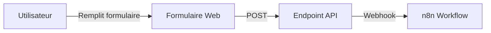

# Système de Soumission de Recettes

Ce guide détaille le système de soumission de recettes, permettant aux visiteurs de proposer leurs propres recettes via une interface web simple et moderne.

## 🎯 Vue d'Ensemble

Le système de soumission comprend :
- Interface web responsive (`soumettre-recette.html`)
- Intégration avec n8n pour l'automatisation
- Formatage automatique des recettes
- Génération de fichiers Markdown Hugo
- Validation et modération du contenu

## 📝 Formulaire de Soumission

### Structure du Formulaire

Le formulaire HTML (`static/soumettre-recette.html`) offre :

```html
<!DOCTYPE html>
<html lang="fr">
<head>
    <meta charset="UTF-8">
    <meta name="viewport" content="width=device-width, initial-scale=1.0">
    <title>Soumettre une Recette - L'atelier Boulet</title>
</head>
<body>
    <div class="container">
        <h1>Soumettre une Recette</h1>
        <form id="recipeForm" action="/api/submit-recipe" method="POST">
            <div class="form-group">
                <label for="title">Titre de la recette</label>
                <input type="text" id="title" name="title" required>
            </div>
            
            <div class="form-group">
                <label for="content">Contenu de la recette</label>
                <textarea id="content" name="content" rows="20" required></textarea>
            </div>
            
            <button type="submit">Soumettre la recette</button>
        </form>
    </div>
</body>
</html>
```

### Champs du Formulaire

1. **Titre** (obligatoire)
   - Nom de la recette
   - Validation : 3-100 caractères
   - Exemple : "Tarte aux pommes de grand-mère"

2. **Contenu** (obligatoire)
   - Format libre ou structuré
   - Instructions pour le format attendu
   - Validation : minimum 100 caractères

### Format Attendu du Contenu

Les utilisateurs doivent structurer leur recette ainsi :

```
[Description de la recette]

Portions : 6
Temps de préparation : 30 minutes
Temps de cuisson : 45 minutes

## Ingrédients
- 6 : Pommes Granny Smith
- 1 : Pâte brisée
- 100g : Sucre
- 50g : Beurre
- 1 c. à soupe : Cannelle

## Préparation
- Préchauffer le four à 180°C
- Éplucher et couper les pommes en tranches
- Disposer les pommes sur la pâte
- Saupoudrer de sucre et cannelle
- Parsemer de noisettes de beurre
- Enfourner pour 45 minutes

## Notes
- Servir tiède avec une boule de glace vanille
- Se conserve 2 jours au réfrigérateur

## Variations
- Ajouter des raisins secs
- Remplacer la cannelle par de la cardamome
```

## 🔄 Workflow de Traitement

### 1. Soumission Initiale



### 2. Traitement n8n

Le workflow n8n effectue :

1. **Réception des données**
   - Validation des champs obligatoires
   - Nettoyage du contenu (XSS, injections)

2. **Parsing du contenu**
   - Extraction des sections (ingrédients, préparation, etc.)
   - Détection du format (libre ou structuré)

3. **Formatage Hugo**
   - Génération du front matter
   - Application des shortcodes
   - Création du fichier Markdown

4. **Sauvegarde**
   - Nom de fichier unique avec timestamp
   - Dossier : `content/posts/`
   - Status : `draft: true` par défaut

### 3. Code de Formatage (n8n)

Le script JavaScript (`static/n8n-code-node-recipe-format.js`) :

```javascript
// Fonction principale de formatage
function formatRecipe(title, content) {
    const timestamp = new Date().toISOString();
    const slug = generateSlug(title);
    const filename = `${slug}-${timestamp}.md`;
    
    // Parser le contenu
    const parsed = parseRecipeContent(content);
    
    // Générer le Markdown Hugo
    const markdown = generateHugoMarkdown({
        title: title,
        date: timestamp,
        ...parsed
    });
    
    return {
        filename: filename,
        content: markdown,
        status: 'draft'
    };
}

// Parser le contenu structuré
function parseRecipeContent(content) {
    const sections = {
        description: '',
        portions: '',
        prepTime: '',
        cookTime: '',
        ingredients: [],
        steps: [],
        notes: [],
        variations: []
    };
    
    // Logique d'extraction...
    
    return sections;
}

// Générer le Markdown avec shortcodes
function generateHugoMarkdown(data) {
    let markdown = `---
title: "${data.title}"
date: ${data.date}
draft: true
tags: ["à-modérer"]
---

${data.description}

{{< recipe-info portions="${data.portions}" prep="${data.prepTime}" cuisson="${data.cookTime}" >}}


${data.ingredients.map(i => `- ${i}`).join('\n')}



${data.steps.map(s => `- ${s}`).join('\n')}
`;

    if (data.notes.length > 0) {
        markdown += `\n\n\n${data.notes.map(n => `- ${n}`).join('\n')}\n`;
    }
    
    if (data.variations.length > 0) {
        markdown += `\n\n\n${data.variations.map(v => `- ${v}`).join('\n')}\n`;
    }
    
    markdown += '\n\n';
    
    return markdown;
}
```

## 🛡️ Validation et Sécurité

### Validation Côté Client

```javascript
// Validation du formulaire
document.getElementById('recipeForm').addEventListener('submit', function(e) {
    e.preventDefault();
    
    const title = document.getElementById('title').value;
    const content = document.getElementById('content').value;
    
    // Validations
    if (title.length < 3 || title.length > 100) {
        alert('Le titre doit contenir entre 3 et 100 caractères');
        return;
    }
    
    if (content.length < 100) {
        alert('La recette doit contenir au moins 100 caractères');
        return;
    }
    
    // Soumettre si valide
    submitRecipe(title, content);
});
```

### Validation Côté Serveur

1. **Sanitisation**
   - Échapper les caractères HTML
   - Supprimer les scripts malveillants
   - Valider les URLs d'images

2. **Limites**
   - Taille maximale : 50KB
   - Rate limiting : 5 soumissions/heure/IP
   - Captcha pour prévenir le spam

3. **Modération**
   - Toutes les recettes en `draft: true`
   - Review manuel avant publication
   - Système de tags pour le suivi

## 📊 Interface d'Administration

### Netlify CMS

Configuration pour gérer les soumissions :

```yaml
# static/admin/config.yml
collections:
  - name: "submissions"
    label: "Soumissions"
    folder: "content/posts"
    create: false
    filter: {field: "tags", value: "à-modérer"}
    fields:
      - {label: "Titre", name: "title", widget: "string"}
      - {label: "Date", name: "date", widget: "datetime"}
      - {label: "Brouillon", name: "draft", widget: "boolean"}
      - {label: "Tags", name: "tags", widget: "list"}
      - {label: "Contenu", name: "body", widget: "markdown"}
```

### Workflow de Modération

1. **Review**
   - Vérifier le contenu
   - Corriger l'orthographe/grammaire
   - Ajuster le formatage

2. **Enrichissement**
   - Ajouter une image
   - Compléter les tags
   - Optimiser le SEO

3. **Publication**
   - Changer `draft: false`
   - Retirer le tag "à-modérer"
   - Notifier l'auteur (optionnel)

## 🎨 Personnalisation de l'Interface

### Styles CSS

Améliorer l'apparence du formulaire :

```css
/* Styles modernes pour le formulaire */
.container {
    max-width: 800px;
    margin: 0 auto;
    padding: 2rem;
}

.form-group {
    margin-bottom: 1.5rem;
}

label {
    display: block;
    font-weight: 600;
    margin-bottom: 0.5rem;
    color: #374151;
}

input[type="text"],
textarea {
    width: 100%;
    padding: 0.75rem;
    border: 2px solid #e5e7eb;
    border-radius: 0.5rem;
    font-size: 1rem;
    transition: border-color 0.2s;
}

input[type="text"]:focus,
textarea:focus {
    outline: none;
    border-color: #2563eb;
}

button[type="submit"] {
    background: linear-gradient(135deg, #2563eb, #1e40af);
    color: white;
    padding: 0.75rem 2rem;
    border: none;
    border-radius: 0.5rem;
    font-size: 1rem;
    font-weight: 600;
    cursor: pointer;
    transition: transform 0.2s;
}

button[type="submit"]:hover {
    transform: translateY(-2px);
}
```

### Améliorations UX

1. **Instructions Claires**
```html
<div class="instructions">
    <h3>📝 Format de la recette</h3>
    <p>Veuillez structurer votre recette avec :</p>
    <ul>
        <li>Une description introductive</li>
        <li>Le nombre de portions</li>
        <li>Les temps de préparation et cuisson</li>
        <li>La liste des ingrédients (format: quantité : ingrédient)</li>
        <li>Les étapes de préparation</li>
        <li>Des notes et variations (optionnel)</li>
    </ul>
</div>
```

2. **Feedback Visuel**
```javascript
// Indicateur de soumission
function submitRecipe(title, content) {
    const button = document.querySelector('button[type="submit"]');
    button.textContent = 'Envoi en cours...';
    button.disabled = true;
    
    // Appel API
    fetch('/api/submit-recipe', {
        method: 'POST',
        headers: {'Content-Type': 'application/json'},
        body: JSON.stringify({title, content})
    })
    .then(response => {
        if (response.ok) {
            showSuccess('Recette soumise avec succès !');
            document.getElementById('recipeForm').reset();
        } else {
            showError('Erreur lors de la soumission');
        }
    })
    .finally(() => {
        button.textContent = 'Soumettre la recette';
        button.disabled = false;
    });
}
```

## 🔗 Intégration avec le Site

### Lien dans le Menu

Ajouter dans `config.toml` :

```toml
[[menu.main]]
  name = "Soumettre une recette"
  url = "/soumettre-recette.html"
  weight = 30
```

### Page de Remerciement

Créer `static/merci-soumission.html` :

```html
<!DOCTYPE html>
<html lang="fr">
<head>
    <title>Merci ! - L'atelier Boulet</title>
</head>
<body>
    <div class="container">
        <h1>🎉 Merci pour votre contribution !</h1>
        <p>Votre recette a été soumise avec succès.</p>
        <p>Notre équipe la révisera dans les prochains jours.</p>
        <a href="/" class="button">Retour à l'accueil</a>
    </div>
</body>
</html>
```

## 📈 Analytics et Suivi

### Métriques à Suivre

1. **Soumissions**
   - Nombre total
   - Taux de conversion
   - Sources de trafic

2. **Qualité**
   - Taux d'approbation
   - Temps de modération
   - Engagement post-publication

### Intégration Google Analytics

```javascript
// Tracker les soumissions
gtag('event', 'recipe_submission', {
    'event_category': 'engagement',
    'event_label': title
});
```

## 🚀 Évolutions Futures

### Améliorations Possibles

1. **Upload d'images**
   - Permettre l'ajout de photos
   - Compression automatique
   - Galerie d'images

2. **Compte utilisateur**
   - Suivi des soumissions
   - Historique personnel
   - Badges et récompenses

3. **IA Assistant**
   - Suggestions d'ingrédients
   - Correction automatique
   - Catégorisation intelligente

4. **API Publique**
   - Endpoints REST
   - Documentation Swagger
   - Webhooks pour intégrations